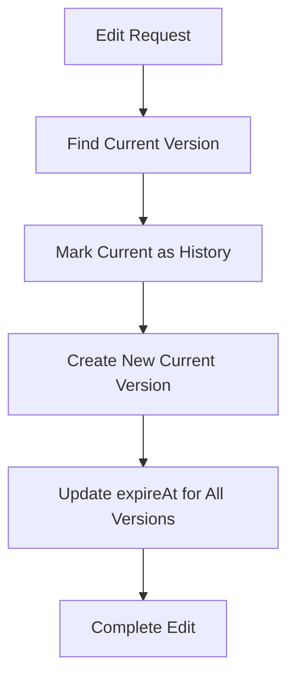
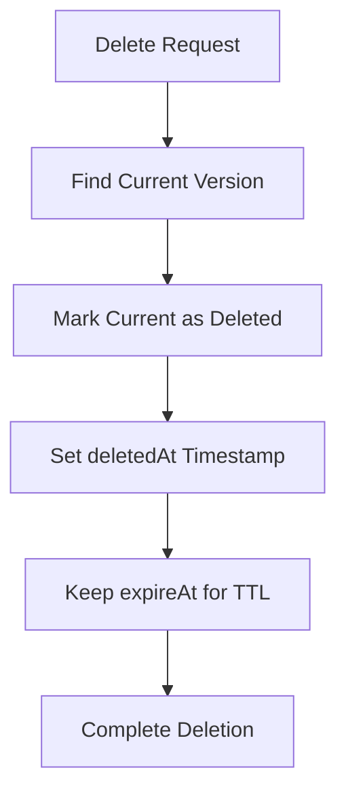

# Firestore Status System Schema Documentation

## Overview

This document describes a comprehensive Firestore schema design for a user status system in a disaster response mobile app. The schema supports full versioning, lineage tracking, and automatic cleanup while maintaining data integrity and query performance.

## Schema Overview

### Collection Structure

```
status (collection)
├── {userId} (document)
│   └── statuses (subcollection)
│       ├── {statusId-v1} (document) - Original status
│       ├── {statusId-v2} (document) - First edit
│       ├── {statusId-v3} (document) - Second edit
│       └── {statusId-deleted} (document) - Deletion record
```

### Design Philosophy

**Flat Versioned Schema**: Instead of nested subcollections for current/history/deleted, all versions exist as separate documents in the same subcollection. This provides:

- **Simplified Queries**: Single collection queries for all operations
- **Better Performance**: No need to query multiple subcollections
- **Atomic Operations**: Each version is independent
- **Consistent TTL**: Single expireAt field manages all cleanup
- **Scalability**: Better distribution across Firestore servers

## Fields Explanation

### Core Fields

| Field        | Type      | Required | Description                                         |
| ------------ | --------- | -------- | --------------------------------------------------- |
| `parentId`   | string    | ✅       | Points to the original status ID (lineage tracking) |
| `versionId`  | string    | ✅       | Unique identifier for this specific version         |
| `statusType` | string    | ✅       | `"current"` \| `"history"` \| `"deleted"`           |
| `createdAt`  | timestamp | ✅       | When this version was created                       |
| `updatedAt`  | timestamp | ❌       | When this version was last modified (for edits)     |
| `deletedAt`  | timestamp | ❌       | When this status was deleted (for deleted type)     |
| `expireAt`   | timestamp | ✅       | TTL field for automatic cleanup after 30 days       |

### Status Data Fields

| Field             | Type           | Required | Description                                              |
| ----------------- | -------------- | -------- | -------------------------------------------------------- |
| `firstName`       | string         | ✅       | User's first name                                        |
| `lastName`        | string         | ✅       | User's last name                                         |
| `phoneNumber`     | string         | ✅       | Contact phone number                                     |
| `statusCondition` | string         | ✅       | `"safe"` \| `"evacuated"` \| `"affected"` \| `"missing"` |
| `lat`             | number \| null | ❌       | Latitude coordinate                                      |
| `lng`             | number \| null | ❌       | Longitude coordinate                                     |
| `location`        | string \| null | ❌       | Human-readable location                                  |
| `note`            | string         | ❌       | Additional notes or description                          |
| `image`           | string         | ❌       | Image URL or path                                        |
| `shareLocation`   | boolean        | ✅       | Whether to share location publicly                       |
| `shareContact`    | boolean        | ✅       | Whether to share contact info publicly                   |

## Versioning Flow

### 1. Original Status Creation

```typescript
// Document ID: status-{timestamp}-v1
{
  parentId: "status-1695123456789",
  versionId: "status-1695123456789-v1",
  statusType: "current",
  firstName: "John",
  lastName: "Doe",
  phoneNumber: "+1234567890",
  statusCondition: "safe",
  lat: 14.5995,
  lng: 120.9842,
  location: "Manila City Hall",
  note: "Safe at evacuation center",
  image: "https://example.com/photo.jpg",
  shareLocation: true,
  shareContact: true,
  createdAt: "2023-09-19T10:30:00Z",
  expireAt: "2023-10-19T10:30:00Z" // 30 days from creation
}
```

### 2. First Edit

```typescript
// Old version becomes history
// Document ID: status-{timestamp}-v1 (updated)
{
  parentId: "status-1695123456789",
  versionId: "status-1695123456789-v1",
  statusType: "history", // ← Changed from "current"
  // ... same data as before
  expireAt: "2023-10-19T10:30:00Z" // Keeps original expiration
}

// New current version
// Document ID: status-{timestamp}-v2
{
  parentId: "status-1695123456789", // ← Same parent
  versionId: "status-1695123456789-v2",
  statusType: "current",
  firstName: "John",
  lastName: "Doe",
  phoneNumber: "+1234567890",
  statusCondition: "evacuated", // ← Changed
  lat: 14.6042,
  lng: 120.9822,
  location: "Safe House Alpha", // ← Changed
  note: "Moved to safer location",
  image: "https://example.com/photo2.jpg",
  shareLocation: true,
  shareContact: false, // ← Changed
  createdAt: "2023-09-19T12:15:00Z",
  updatedAt: "2023-09-19T12:15:00Z",
  expireAt: "2023-10-19T10:30:00Z" // Same as parent
}
```

## Editing Flow

### Process Overview



### Implementation Steps

1. **Find Current Version**

   ```typescript
   const currentStatus = await db
     .collection("status")
     .doc(userId)
     .collection("statuses")
     .where("parentId", "==", parentId)
     .where("statusType", "==", "current")
     .limit(1)
     .get();
   ```

2. **Mark Current as History**

   ```typescript
   await currentDoc.ref.update({
     statusType: "history",
   });
   ```

3. **Create New Current Version**
   ```typescript
   const newVersionId = `${parentId}-v${nextVersionNumber}`;
   await statusesRef.doc(newVersionId).set({
     parentId: parentId,
     versionId: newVersionId,
     statusType: "current",
     ...newStatusData,
     createdAt: FieldValue.serverTimestamp(),
     updatedAt: FieldValue.serverTimestamp(),
     expireAt: originalExpireAt, // Inherit from parent
   });
   ```

## Deleting Flow

### Process Overview



### Soft Delete Implementation

```typescript
// Mark current version as deleted
await currentDoc.ref.update({
  statusType: "deleted",
  deletedAt: FieldValue.serverTimestamp(),
  // expireAt remains the same for TTL cleanup
});
```

### Deleted Status Example

```typescript
{
  parentId: "status-1695123456789",
  versionId: "status-1695123456789-v2",
  statusType: "deleted", // ← Marked as deleted
  firstName: "John",
  lastName: "Doe",
  phoneNumber: "+1234567890",
  statusCondition: "evacuated",
  // ... rest of data preserved
  createdAt: "2023-09-19T12:15:00Z",
  updatedAt: "2023-09-19T12:15:00Z",
  deletedAt: "2023-09-19T14:30:00Z", // ← Deletion timestamp
  expireAt: "2023-10-19T10:30:00Z" // ← Still expires with original TTL
}
```

## Cleanup with TTL (Time To Live)

### Firestore TTL Configuration

```typescript
// Enable TTL on the expireAt field
// This is configured in Firestore console or Admin SDK
```

### TTL Rules

- **30 Day Retention**: All status versions expire 30 days after the original creation
- **Automatic Cleanup**: Firestore automatically deletes expired documents
- **Lineage Cleanup**: All versions (current, history, deleted) share the same `expireAt`
- **No Manual Cleanup**: TTL handles all cleanup automatically

### TTL Best Practices

```typescript
// When creating original status
const expireAt = new Date();
expireAt.setDate(expireAt.getDate() + 30); // 30 days from now

// All versions inherit this expireAt timestamp
{
  // ... status data
  expireAt: admin.firestore.Timestamp.fromDate(expireAt);
}
```

## Query Examples

### 1. Get Current Status for User

```typescript
const getCurrentStatus = async (userId: string, parentId: string) => {
  const snapshot = await db
    .collection("status")
    .doc(userId)
    .collection("statuses")
    .where("parentId", "==", parentId)
    .where("statusType", "==", "current")
    .limit(1)
    .get();

  return snapshot.empty ? null : snapshot.docs[0].data();
};
```

### 2. Get All User Statuses (Current Only)

```typescript
const getAllCurrentStatuses = async (userId: string) => {
  const snapshot = await db
    .collection("status")
    .doc(userId)
    .collection("statuses")
    .where("statusType", "==", "current")
    .orderBy("createdAt", "desc")
    .get();

  return snapshot.docs.map((doc) => doc.data());
};
```

### 3. Get Status History (Lineage Tracking)

```typescript
const getStatusLineage = async (userId: string, parentId: string) => {
  const snapshot = await db
    .collection("status")
    .doc(userId)
    .collection("statuses")
    .where("parentId", "==", parentId)
    .orderBy("createdAt", "asc")
    .get();

  return snapshot.docs.map((doc) => ({
    id: doc.id,
    ...doc.data(),
  }));
};
```

### 4. Get Deleted Statuses

```typescript
const getDeletedStatuses = async (userId: string) => {
  const snapshot = await db
    .collection("status")
    .doc(userId)
    .collection("statuses")
    .where("statusType", "==", "deleted")
    .orderBy("deletedAt", "desc")
    .get();

  return snapshot.docs.map((doc) => doc.data());
};
```

### 5. Search Active Statuses by Condition

```typescript
const getStatusesByCondition = async (userId: string, condition: string) => {
  const snapshot = await db
    .collection("status")
    .doc(userId)
    .collection("statuses")
    .where("statusType", "==", "current")
    .where("statusCondition", "==", condition)
    .get();

  return snapshot.docs.map((doc) => doc.data());
};
```

## Example JSON Documents

### Document Lifecycle Example

#### Original Creation

```json
{
  "parentId": "status-1695123456789",
  "versionId": "status-1695123456789-v1",
  "statusType": "current",
  "firstName": "Maria",
  "lastName": "Santos",
  "phoneNumber": "+639171234567",
  "statusCondition": "affected",
  "lat": 14.5995,
  "lng": 120.9842,
  "location": "Barangay San Antonio",
  "note": "House flooded, need evacuation",
  "image": "",
  "shareLocation": true,
  "shareContact": true,
  "createdAt": "2023-09-19T08:00:00Z",
  "expireAt": "2023-10-19T08:00:00Z"
}
```

#### After First Edit

```json
// v1 becomes history
{
  "parentId": "status-1695123456789",
  "versionId": "status-1695123456789-v1",
  "statusType": "history",
  "firstName": "Maria",
  "lastName": "Santos",
  "phoneNumber": "+639171234567",
  "statusCondition": "affected",
  "lat": 14.5995,
  "lng": 120.9842,
  "location": "Barangay San Antonio",
  "note": "House flooded, need evacuation",
  "image": "",
  "shareLocation": true,
  "shareContact": true,
  "createdAt": "2023-09-19T08:00:00Z",
  "expireAt": "2023-10-19T08:00:00Z"
}

// v2 becomes current
{
  "parentId": "status-1695123456789",
  "versionId": "status-1695123456789-v2",
  "statusType": "current",
  "firstName": "Maria",
  "lastName": "Santos",
  "phoneNumber": "+639171234567",
  "statusCondition": "safe",
  "lat": 14.6042,
  "lng": 120.9822,
  "location": "Evacuation Center Alpha",
  "note": "Successfully evacuated to center",
  "image": "https://storage.example.com/evacuation-photo.jpg",
  "shareLocation": true,
  "shareContact": true,
  "createdAt": "2023-09-19T10:30:00Z",
  "updatedAt": "2023-09-19T10:30:00Z",
  "expireAt": "2023-10-19T08:00:00Z"
}
```

#### After Deletion

```json
{
  "parentId": "status-1695123456789",
  "versionId": "status-1695123456789-v2",
  "statusType": "deleted",
  "firstName": "Maria",
  "lastName": "Santos",
  "phoneNumber": "+639171234567",
  "statusCondition": "safe",
  "lat": 14.6042,
  "lng": 120.9822,
  "location": "Evacuation Center Alpha",
  "note": "Successfully evacuated to center",
  "image": "https://storage.example.com/evacuation-photo.jpg",
  "shareLocation": true,
  "shareContact": true,
  "createdAt": "2023-09-19T10:30:00Z",
  "updatedAt": "2023-09-19T10:30:00Z",
  "deletedAt": "2023-09-19T16:45:00Z",
  "expireAt": "2023-10-19T08:00:00Z"
}
```

## Best Practices

### 1. Document ID Strategy

```typescript
// Use descriptive, sortable IDs
const generateVersionId = (parentId: string, versionNumber: number) => {
  return `${parentId}-v${versionNumber}`;
};

const generateParentId = () => {
  return `status-${Date.now()}`;
};
```

### 2. Batch Operations for Edits

```typescript
const editStatus = async (userId: string, parentId: string, newData: any) => {
  const batch = db.batch();

  // Update current to history
  const currentRef = /* find current version */;
  batch.update(currentRef, { statusType: 'history' });

  // Create new current
  const newRef = /* new version reference */;
  batch.set(newRef, { ...newData, statusType: 'current' });

  await batch.commit();
};
```

### 3. Error Handling

```typescript
const safeStatusOperation = async (operation: Function) => {
  try {
    await operation();
  } catch (error) {
    console.error("Status operation failed:", error);
    // Implement retry logic or fallback
    throw new Error("Status operation failed");
  }
};
```

### 4. Index Optimization

Create composite indexes for common queries:

```
Collection: status/{userId}/statuses
Indexes:
- parentId ASC, statusType ASC, createdAt DESC
- statusType ASC, statusCondition ASC, createdAt DESC
- statusType ASC, expireAt ASC (for TTL cleanup queries)
```

## Scalability Considerations

### 1. Document Count Limits

- **Subcollection Limit**: 1M documents per subcollection
- **User Capacity**: ~33,333 statuses per user (assuming 30 versions each)
- **Mitigation**: Use year-based sharding if needed

### 2. Query Performance

- **Pagination**: Use `startAfter()` for large result sets
- **Indexing**: Maintain composite indexes for common query patterns
- **Caching**: Cache current statuses in client state

### 3. Storage Optimization

- **Image Storage**: Store images in Cloud Storage, not Firestore
- **Text Limits**: Limit note field to reasonable character count
- **Cleanup**: TTL automatically manages storage growth

### 4. Write Costs

- **Batch Operations**: Group related writes to reduce costs
- **Conditional Updates**: Only update when data actually changes
- **Strategic Indexing**: Balance query performance vs. write costs

## Why Flat Versioning Over Nested Subcollections

### ❌ Nested Approach Issues

```
status/{userId}/statuses/{statusId}/
├── current/ (subcollection)
├── history/ (subcollection)
└── deleted/ (subcollection)
```

**Problems:**

- Complex queries across multiple subcollections
- Difficult lineage tracking
- Inconsistent TTL implementation
- Poor performance for timeline views
- Complicated backup/restore operations

### ✅ Flat Approach Benefits

```
status/{userId}/statuses/
├── {statusId-v1} (document)
├── {statusId-v2} (document)
└── {statusId-deleted} (document)
```

**Advantages:**

- Single collection queries
- Consistent TTL across all versions
- Simplified lineage tracking with `parentId`
- Better query performance
- Easier data migration and backup
- Atomic operations across versions

## Security Rules Example

```javascript
// Firestore Security Rules
rules_version = '2';
service cloud.firestore {
  match /databases/{database}/documents {
    // Status documents
    match /status/{userId}/statuses/{statusId} {
      // Users can only access their own statuses
      allow read, write: if request.auth != null
        && request.auth.uid == userId;

      // Validate status types
      allow write: if resource.data.statusType in ['current', 'history', 'deleted'];

      // Prevent modification of expired documents
      allow write: if resource.data.expireAt > request.time;
    }
  }
}
```

## Monitoring and Analytics

### Key Metrics to Track

1. **Version Distribution**: Monitor average versions per status
2. **Storage Growth**: Track document count and size over time
3. **TTL Effectiveness**: Verify automatic cleanup is working
4. **Query Performance**: Monitor slow queries and optimize indexes
5. **Error Rates**: Track failed operations and implement alerts

### Example Monitoring Query

```typescript
const getStatusMetrics = async (userId: string) => {
  const snapshot = await db
    .collection("status")
    .doc(userId)
    .collection("statuses")
    .get();

  const metrics = {
    totalDocuments: snapshot.size,
    currentStatuses: 0,
    historyRecords: 0,
    deletedRecords: 0,
    avgVersionsPerStatus: 0,
  };

  const parentGroups = new Map();

  snapshot.docs.forEach((doc) => {
    const data = doc.data();
    const parentId = data.parentId;

    // Count by type
    metrics[
      `${data.statusType}${
        data.statusType === "current" ? "Statuses" : "Records"
      }`
    ]++;

    // Group by parent for version counting
    if (!parentGroups.has(parentId)) {
      parentGroups.set(parentId, 0);
    }
    parentGroups.set(parentId, parentGroups.get(parentId) + 1);
  });

  // Calculate average versions
  if (parentGroups.size > 0) {
    const totalVersions = Array.from(parentGroups.values()).reduce(
      (a, b) => a + b,
      0
    );
    metrics.avgVersionsPerStatus = (totalVersions / parentGroups.size).toFixed(
      2
    );
  }

  return metrics;
};
```

---

## Conclusion

This flat versioned schema provides a robust foundation for a disaster response status system with complete audit trails, automatic cleanup, and excellent query performance. The design balances data integrity with operational efficiency while maintaining scalability for large user bases.

The TTL-based cleanup ensures storage costs remain manageable, while the flat structure simplifies development and maintenance operations. This schema can handle the demanding requirements of emergency response scenarios while providing the flexibility needed for future feature enhancements.
