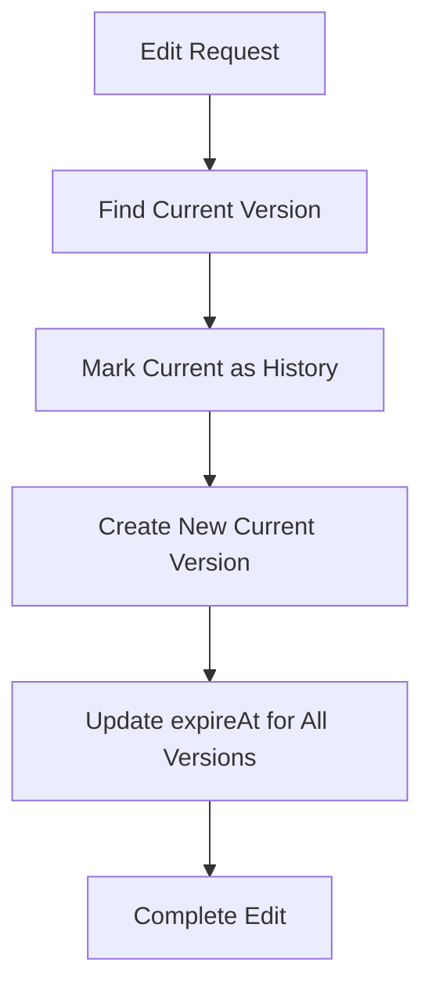
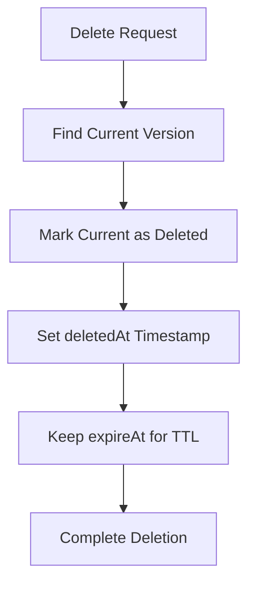

# Firestore Status System Schema Documentation

## Overview

This document describes a comprehensive Firestore schema design for a user status system in a disaster response mobile app. The schema supports single active status per user, full versioning, lineage tracking, and managed cleanup while maintaining data integrity and query performance.

## Key Requirements

- **Single Active Status**: Each user can only have one active status at a time
- **Update Instead of Create**: Creating a new status while having an active one will update the existing status
- **User-Controlled Expiration**: Users choose 12 or 24-hour expiration for their status
- **History Retention**: Expired/deleted status versions remain for 30 days before permanent deletion
- **Version Control**: Each update creates a new version with complete audit trail

## Schema Overview

### Collection Structure

```
status (collection)
├── {userId} (document)
│   └── statuses (subcollection)
│       ├── {statusId-v1} (document) - Original status
│       ├── {statusId-v2} (document) - Updated version (v1 → history)
│       ├── {statusId-v3} (document) - Another update (v2 → history)
│       └── {statusId-deleted} (document) - Soft deletion record
```

**Note**: Only ONE status can have `statusType: "current"` per user at any time.

### Design Philosophy

**Single Active Status with Flat Versioning**: Each user has only one active status, with all versions stored as separate documents in the same subcollection. This provides:

- **Single Source of Truth**: Only one current status per user prevents conflicts
- **Update-First Approach**: New status creation updates existing instead of creating duplicates
- **User-Controlled Lifecycle**: Users choose their status expiration (12h/24h)
- **Managed History Retention**: System automatically cleans up after 30 days
- **Complete Audit Trail**: Full version history with lineage tracking
- **Simplified Queries**: Single collection queries for all operations
- **Better Performance**: No need to query multiple subcollections
- **Scalability**: Better distribution across Firestore servers

## Fields Explanation

### TypeScript Interface Definition

```typescript
// Core status data interface
interface StatusData {
  // Core versioning fields
  parentId: string;
  versionId: string;
  statusType: 'current' | 'history' | 'deleted';

  // User identification
  uid: string;

  // Personal information
  firstName: string;
  lastName: string;
  phoneNumber: string;

  // Status information
  condition: 'safe' | 'evacuated' | 'affected' | 'missing';

  // Location data
  lat: number | null;
  lng: number | null;
  location?: string | null;

  // Additional information
  note: string;
  image: string;

  // Privacy settings
  shareLocation: boolean;
  shareContact: boolean;

  // Expiration settings (user-controlled)
  expirationDuration: 12 | 24; // hours
  expiresAt: FirebaseFirestore.Timestamp; // when status becomes inactive

  // Timestamps
  createdAt: FirebaseFirestore.Timestamp | string;
  updatedAt?: FirebaseFirestore.Timestamp | string;
  deletedAt?: FirebaseFirestore.Timestamp | string;

  // System-managed cleanup (30 days retention for history)
  retentionUntil: FirebaseFirestore.Timestamp; // when history is permanently deleted
}

// Type for creating new status (excludes system fields)
type CreateStatusData = Omit<
  StatusData,
  'parentId' | 'versionId' | 'statusType' | 'createdAt' | 'retentionUntil' | 'updatedAt' | 'deletedAt'
>;

// Type for updating status (partial fields)
type UpdateStatusData = Partial<
  Omit<StatusData, 'parentId' | 'versionId' | 'statusType' | 'uid' | 'createdAt' | 'retentionUntil'>
>;

// Status condition enum
enum Condition {
  SAFE = 'safe',
  EVACUATED = 'evacuated',
  AFFECTED = 'affected',
  MISSING = 'missing',
}

// Status type enum
enum StatusType {
  CURRENT = 'current',
  HISTORY = 'history',
  DELETED = 'deleted',
}

// Expiration duration options
enum ExpirationDuration {
  TWELVE_HOURS = 12,
  TWENTY_FOUR_HOURS = 24,
}

// Location coordinates interface
interface Coordinates {
  lat: number;
  lng: number;
}

// Contact information interface
interface ContactInfo {
  phoneNumber: string;
  shareContact: boolean;
}

// Privacy settings interface
interface PrivacySettings {
  shareLocation: boolean;
  shareContact: boolean;
}

// Expiration settings interface
interface ExpirationSettings {
  expirationDuration: 12 | 24;
  expiresAt: FirebaseFirestore.Timestamp;
}
```

### Core Fields

| Field                | Type                                    | Required | Description                                                        |
| -------------------- | --------------------------------------- | -------- | ------------------------------------------------------------------ |
| `parentId`           | `string`                                | ✅       | Points to the original status ID (lineage tracking)                |
| `versionId`          | `string`                                | ✅       | Unique identifier for this specific version                        |
| `statusType`         | `'current' \| 'history' \| 'deleted'`   | ✅       | Document lifecycle state (only ONE current per user)               |
| `expirationDuration` | `12 \| 24`                              | ✅       | User-chosen expiration duration in hours                           |
| `expiresAt`          | `FirebaseFirestore.Timestamp`           | ✅       | When status becomes inactive (user-controlled)                     |
| `retentionUntil`     | `FirebaseFirestore.Timestamp`           | ✅       | When history is permanently deleted (30 days from expiry/deletion) |
| `createdAt`          | `FirebaseFirestore.Timestamp \| string` | ✅       | When this version was created                                      |
| `updatedAt`          | `FirebaseFirestore.Timestamp \| string` | ❌       | When this version was last modified (for edits)                    |
| `deletedAt`          | `FirebaseFirestore.Timestamp \| string` | ❌       | When this status was deleted (for deleted type)                    |

### Status Data Fields

| Field           | Type                                               | Required | Description                                     |
| --------------- | -------------------------------------------------- | -------- | ----------------------------------------------- |
| `uid`           | `string`                                           | ✅       | Firebase user identifier                        |
| `firstName`     | `string`                                           | ✅       | User's first name                               |
| `lastName`      | `string`                                           | ✅       | User's last name                                |
| `phoneNumber`   | `string`                                           | ✅       | Contact phone number (formatted)                |
| `condition`     | `'safe' \| 'evacuated' \| 'affected' \| 'missing'` | ✅       | Current emergency status condition (renamed)    |
| `lat`           | `number \| null`                                   | ❌       | Latitude coordinate (decimal degrees)           |
| `lng`           | `number \| null`                                   | ❌       | Longitude coordinate (decimal degrees)          |
| `location`      | `string \| null`                                   | ❌       | Human-readable location description             |
| `note`          | `string`                                           | ❌       | Additional notes or description (max 500 chars) |
| `image`         | `string`                                           | ❌       | Image URL or Cloud Storage path                 |
| `shareLocation` | `boolean`                                          | ✅       | Whether to share location publicly              |
| `shareContact`  | `boolean`                                          | ✅       | Whether to share contact info publicly          |

### Field Validation Rules

```typescript
// Field validation constraints
const StatusValidation = {
  // Personal information constraints
  firstName: {
    minLength: 1,
    maxLength: 50,
    pattern: /^[a-zA-Z\s\-\.\']+$/,
    required: true,
  },
  lastName: {
    minLength: 1,
    maxLength: 50,
    pattern: /^[a-zA-Z\s\-\.\']+$/,
    required: true,
  },
  phoneNumber: {
    pattern: /^\+?[\d\-\(\)\s]+$/,
    minLength: 10,
    maxLength: 20,
    required: true,
  },

  // Status constraints
  condition: {
    enum: ['safe', 'evacuated', 'affected', 'missing'],
    required: true,
  },

  // Expiration constraints
  expirationDuration: {
    enum: [12, 24],
    required: true,
  },

  // Location constraints
  lat: {
    min: -90,
    max: 90,
    type: 'number',
  },
  lng: {
    min: -180,
    max: 180,
    type: 'number',
  },
  location: {
    maxLength: 200,
    type: 'string',
  },

  // Content constraints
  note: {
    maxLength: 500,
    type: 'string',
  },
  image: {
    pattern: /^(https?:\/\/|gs:\/\/).+$/,
    maxLength: 500,
    type: 'string',
  },

  // System field constraints
  parentId: {
    pattern: /^status-\d+$/,
    required: true,
  },
  versionId: {
    pattern: /^status-\d+-v\d+$/,
    required: true,
  },
};

// Field default values
const StatusDefaults = {
  note: '',
  image: '',
  lat: null,
  lng: null,
  location: null,
  shareLocation: true,
  shareContact: true,
};
```

### Data Type Examples

```typescript
// Example of valid field values
const exampleStatusData: StatusData = {
  // System fields
  parentId: 'status-1695123456789',
  versionId: 'status-1695123456789-v1',
  statusType: 'current',
  uid: 'firebase-user-uid-123',

  // Personal information
  firstName: 'Maria Elena',
  lastName: 'Santos-Dela Cruz',
  phoneNumber: '+63-917-123-4567',

  // Status information
  condition: 'affected',

  // Expiration settings
  expirationDuration: 24,
  expiresAt: admin.firestore.Timestamp.fromDate(
    new Date(Date.now() + 24 * 60 * 60 * 1000) // 24 hours from now
  ),

  // Location data (Philippines coordinates)
  lat: 14.5995124,
  lng: 120.9842195,
  location: 'Barangay San Antonio, Manila',

  // Additional information
  note: 'House flooded, need evacuation assistance. Family of 4 with elderly.',
  image: 'gs://rescuenect-storage/status-images/user123/photo-123.jpg',

  // Privacy settings
  shareLocation: true,
  shareContact: false,

  // Timestamps (Firestore types)
  createdAt: admin.firestore.Timestamp.now(),
  retentionUntil: admin.firestore.Timestamp.fromDate(
    new Date(Date.now() + 30 * 24 * 60 * 60 * 1000) // 30 days for history retention
  ),
};
```

## Versioning Flow

### 1. Original Status Creation

```typescript
// Document ID: status-{timestamp}-v1
{
  parentId: "status-1695123456789",
  versionId: "status-1695123456789-v1",
  statusType: "current",
  firstName: "John",
  lastName: "Doe",
  phoneNumber: "+1234567890",
  condition: "safe",
  expirationDuration: 24,
  expiresAt: "2023-09-20T10:30:00Z", // 24 hours from creation
  lat: 14.5995,
  lng: 120.9842,
  location: "Manila City Hall",
  note: "Safe at evacuation center",
  image: "https://example.com/photo.jpg",
  shareLocation: true,
  shareContact: true,
  createdAt: "2023-09-19T10:30:00Z",
  retentionUntil: "2023-10-19T10:30:00Z" // 30 days from creation for history cleanup
}
```

### 2. First Edit

```typescript
// Old version becomes history
// Document ID: status-{timestamp}-v1 (updated)
{
  parentId: "status-1695123456789",
  versionId: "status-1695123456789-v1",
  statusType: "history", // ← Changed from "current"
  // ... same data as before
  retentionUntil: "2023-10-19T10:30:00Z" // Keeps original retention date
}

// New current version
// Document ID: status-{timestamp}-v2
{
  parentId: "status-1695123456789", // ← Same parent
  versionId: "status-1695123456789-v2",
  statusType: "current",
  firstName: "John",
  lastName: "Doe",
  phoneNumber: "+1234567890",
  condition: "evacuated", // ← Changed
  expirationDuration: 12, // ← Changed to 12 hours
  expiresAt: "2023-09-19T24:15:00Z", // ← 12 hours from update
  lat: 14.6042,
  lng: 120.9822,
  location: "Safe House Alpha", // ← Changed
  note: "Moved to safer location",
  image: "https://example.com/photo2.jpg",
  shareLocation: true,
  shareContact: false, // ← Changed
  createdAt: "2023-09-19T12:15:00Z",
  updatedAt: "2023-09-19T12:15:00Z",
  retentionUntil: "2023-10-19T10:30:00Z" // Same as parent
}
```

## Editing Flow

### Process Overview



### Implementation Steps

1. **Find Current Version**

   ```typescript
   const currentStatus = await db
     .collection('status')
     .doc(userId)
     .collection('statuses')
     .where('parentId', '==', parentId)
     .where('statusType', '==', 'current')
     .limit(1)
     .get();
   ```

2. **Mark Current as History**

   ```typescript
   await currentDoc.ref.update({
     statusType: 'history',
   });
   ```

3. **Create New Current Version**
   ```typescript
   const newVersionId = `${parentId}-v${nextVersionNumber}`;
   await statusesRef.doc(newVersionId).set({
     parentId: parentId,
     versionId: newVersionId,
     statusType: 'current',
     ...newStatusData,
     createdAt: FieldValue.serverTimestamp(),
     updatedAt: FieldValue.serverTimestamp(),
     expireAt: originalExpireAt, // Inherit from parent
   });
   ```

## Deleting Flow

### Process Overview



### Soft Delete Implementation

```typescript
// Mark current version as deleted
await currentDoc.ref.update({
  statusType: 'deleted',
  deletedAt: FieldValue.serverTimestamp(),
  // expireAt remains the same for TTL cleanup
});
```

### Deleted Status Example

```typescript
{
  parentId: "status-1695123456789",
  versionId: "status-1695123456789-v2",
  statusType: "deleted", // ← Marked as deleted
  firstName: "John",
  lastName: "Doe",
  phoneNumber: "+1234567890",
  condition: "evacuated",
  expirationDuration: 24,
  expiresAt: "2023-09-20T12:15:00Z",
  // ... rest of data preserved
  createdAt: "2023-09-19T12:15:00Z",
  updatedAt: "2023-09-19T12:15:00Z",
  deletedAt: "2023-09-19T14:30:00Z", // ← Deletion timestamp
  retentionUntil: "2023-10-19T10:30:00Z" // ← Cleanup after 30 days from creation
}
```

## Cleanup Strategy

### Two-Tier Expiration System

1. **User-Controlled Status Expiration** (`expiresAt`)

   - Users choose 12 or 24-hour expiration when creating status
   - When expired, status moves from "current" to "history" automatically
   - Handled by scheduled functions or cron jobs

2. **System-Managed History Retention** (`retentionUntil`)
   - History records (expired or deleted) remain for 30 days
   - After 30 days, documents are permanently deleted
   - Prevents database growth while maintaining audit trail

### Cleanup Implementation Options

**Firebase Scheduled Functions (Recommended)**

```typescript
// Deploy with Firebase Functions
import { onSchedule } from 'firebase-functions/v2/scheduler';
import * as admin from 'firebase-admin';

export const cleanupExpiredStatuses = onSchedule('every 1 hours', async () => {
  const db = admin.firestore();
  const batch = db.batch();
  let batchCount = 0;
  const maxBatchSize = 500; // Firestore batch limit

  console.log('🔄 Starting cleanup of expired statuses...');

  try {
    // Query ALL expired current statuses across ALL users at once
    const expiredStatuses = await db
      .collectionGroup('statuses') // ← This queries across ALL users
      .where('statusType', '==', 'current')
      .where('expiresAt', '<=', admin.firestore.Timestamp.now())
      .limit(500) // Process in chunks to avoid memory issues
      .get();

    console.log(`📊 Found ${expiredStatuses.size} expired current statuses`);

    // Process each expired status
    for (const doc of expiredStatuses.docs) {
      // Move from "current" to "history"
      batch.update(doc.ref, {
        statusType: 'history',
        expiredAt: admin.firestore.FieldValue.serverTimestamp(),
      });

      batchCount++;

      // Commit batch when it reaches limit
      if (batchCount >= maxBatchSize) {
        await batch.commit();
        console.log(`✅ Committed batch of ${batchCount} status updates`);
        batchCount = 0;
      }
    }

    // Commit remaining documents
    if (batchCount > 0) {
      await batch.commit();
      console.log(`✅ Committed final batch of ${batchCount} status updates`);
    }

    console.log(`✅ Successfully moved ${expiredStatuses.size} statuses to history`);
  } catch (error) {
    console.error('❌ Error in status expiration cleanup:', error);
    throw error;
  }
});

export const cleanupRetentionExpired = onSchedule('every 24 hours', async () => {
  const db = admin.firestore();
  const batch = db.batch();
  let batchCount = 0;
  const maxBatchSize = 500;

  console.log('🗑️ Starting cleanup of retention-expired documents...');

  try {
    // Query ALL retention-expired documents across ALL users at once
    const expiredHistory = await db
      .collectionGroup('statuses') // ← This queries across ALL users
      .where('statusType', 'in', ['history', 'deleted'])
      .where('retentionUntil', '<=', admin.firestore.Timestamp.now())
      .limit(500) // Process in chunks
      .get();

    console.log(`📊 Found ${expiredHistory.size} retention-expired documents`);

    // Delete each expired document
    for (const doc of expiredHistory.docs) {
      batch.delete(doc.ref);
      batchCount++;

      // Commit batch when it reaches limit
      if (batchCount >= maxBatchSize) {
        await batch.commit();
        console.log(`🗑️ Deleted batch of ${batchCount} expired documents`);
        batchCount = 0;
      }
    }

    // Commit remaining documents
    if (batchCount > 0) {
      await batch.commit();
      console.log(`🗑️ Deleted final batch of ${batchCount} expired documents`);
    }

    console.log(`✅ Successfully deleted ${expiredHistory.size} expired documents`);
  } catch (error) {
    console.error('❌ Error in retention cleanup:', error);
    throw error;
  }
});

// Optional: Cleanup function for very large datasets
export const cleanupExpiredStatusesLarge = onSchedule('every 6 hours', async () => {
  const db = admin.firestore();
  let totalProcessed = 0;
  let hasMore = true;

  console.log('🔄 Starting large-scale cleanup process...');

  // Process in multiple rounds for very large datasets
  while (hasMore && totalProcessed < 10000) {
    // Safety limit
    const batch = db.batch();
    let batchCount = 0;

    // Query next batch of expired documents
    const expiredDocs = await db
      .collectionGroup('statuses')
      .where('statusType', '==', 'current')
      .where('expiresAt', '<=', admin.firestore.Timestamp.now())
      .limit(500)
      .get();

    if (expiredDocs.empty) {
      hasMore = false;
      break;
    }

    // Process each document in current batch
    for (const doc of expiredDocs.docs) {
      batch.update(doc.ref, {
        statusType: 'history',
        expiredAt: admin.firestore.FieldValue.serverTimestamp(),
      });
      batchCount++;
    }

    // Commit current batch
    if (batchCount > 0) {
      await batch.commit();
      totalProcessed += batchCount;
      console.log(`📊 Processed ${totalProcessed} documents so far...`);
    }

    // Small delay to avoid overwhelming Firestore
    await new Promise(resolve => setTimeout(resolve, 1000));
  }

  console.log(`✅ Large-scale cleanup completed. Total processed: ${totalProcessed}`);
});
```

**Key Points:**

1. **Collection Group Queries**: Uses `collectionGroup("statuses")` to query across ALL user subcollections at once
2. **Efficient Processing**: Processes up to 500 documents per batch to stay within Firestore limits
3. **No User Iteration**: Never loops through individual users - queries all expired documents directly
4. **Batch Operations**: Uses Firestore batch writes for efficient updates/deletes
5. **Chunked Processing**: Handles large datasets by processing in manageable chunks
6. **Safety Limits**: Includes limits and delays to prevent overwhelming Firestore

**Performance Benefits:**

- ✅ **Single Query**: One query finds all expired documents across all users
- ✅ **Batch Operations**: Up to 500 operations per batch (Firestore limit)
- ✅ **Parallel Processing**: Firestore handles the parallel execution
- ✅ **Automatic Scaling**: Scales with your user base without code changes

**External Cron Jobs Example**

```typescript
// Run on external server with Admin SDK
import * as admin from 'firebase-admin';

const cleanupExpiredStatusesExternal = async () => {
  const db = admin.firestore();
  let lastDoc = null;
  let totalProcessed = 0;

  console.log('🔄 Starting external cleanup process...');

  do {
    // Build query with pagination
    let query = db
      .collectionGroup('statuses')
      .where('statusType', '==', 'current')
      .where('expiresAt', '<=', admin.firestore.Timestamp.now())
      .limit(1000); // Larger batches for external processing

    // Add pagination cursor
    if (lastDoc) {
      query = query.startAfter(lastDoc);
    }

    const snapshot = await query.get();

    if (snapshot.empty) {
      break;
    }

    // Process current batch
    const batch = db.batch();
    snapshot.docs.forEach(doc => {
      batch.update(doc.ref, {
        statusType: 'history',
        expiredAt: admin.firestore.FieldValue.serverTimestamp(),
      });
    });

    await batch.commit();

    totalProcessed += snapshot.size;
    lastDoc = snapshot.docs[snapshot.docs.length - 1];

    console.log(`📊 Processed ${totalProcessed} documents...`);

    // Rate limiting
    await new Promise(resolve => setTimeout(resolve, 500));
  } while (lastDoc);

  console.log(`✅ External cleanup completed. Total: ${totalProcessed}`);
};
```

### Expiration Rules

- **Status Lifecycle**: Active → History (after `expiresAt`) → Deleted (after `retentionUntil`)
- **User Updates**: Reset `expiresAt`, keep original `retentionUntil`
- **Manual Deletion**: Set `deletedAt`, calculate new `retentionUntil` (30 days from deletion)
- **Single Active Rule**: Only one "current" status per user at any time

## Query Examples

### 1. Create New Status

```typescript
const createOrUpdateStatus = async (
  userId: string,
  statusData: Omit<
    StatusData,
    'parentId' | 'versionId' | 'statusType' | 'createdAt' | 'expiresAt' | 'retentionUntil'
  > & { expirationDuration: 12 | 24 }
) => {
  try {
    // Check if user already has an active status
    const existingStatusQuery = await db
      .collection('status')
      .doc(userId)
      .collection('statuses')
      .where('statusType', '==', 'current')
      .limit(1)
      .get();

    if (!existingStatusQuery.empty) {
      // Update existing status instead of creating new one
      const existingDoc = existingStatusQuery.docs[0];
      const existingData = existingDoc.data();
      return await updateStatus(userId, existingData.parentId, statusData);
    }

    // Generate IDs for new status
    const parentId = `status-${Date.now()}`;
    const versionId = `${parentId}-v1`;

    // Set user-chosen expiration (12 or 24 hours)
    const expiresAt = new Date();
    expiresAt.setHours(expiresAt.getHours() + statusData.expirationDuration);

    // Set history retention (30 days from creation)
    const retentionUntil = new Date();
    retentionUntil.setDate(retentionUntil.getDate() + 30);

    // Create document reference
    const statusRef = db.collection('status').doc(userId).collection('statuses').doc(versionId);

    // Create the status document
    await statusRef.set({
      parentId: parentId,
      versionId: versionId,
      statusType: 'current',
      ...statusData,
      expiresAt: admin.firestore.Timestamp.fromDate(expiresAt),
      retentionUntil: admin.firestore.Timestamp.fromDate(retentionUntil),
      createdAt: FieldValue.serverTimestamp(),
    });

    console.log(`✅ Status created with ID: ${parentId}`);
    return { parentId, versionId };
  } catch (error) {
    console.error('❌ Error creating status:', error);
    throw new Error('Failed to create status');
  }
};

// Usage example - will update existing if user has active status
const newStatus = await createOrUpdateStatus('user123', {
  uid: 'user123',
  firstName: 'John',
  lastName: 'Doe',
  phoneNumber: '+1234567890',
  condition: 'safe',
  expirationDuration: 24, // User chooses 24 hours
  lat: 14.5995,
  lng: 120.9842,
  location: 'Manila City Hall',
  note: 'Safe at evacuation center',
  image: '',
  shareLocation: true,
  shareContact: true,
});
```

### 2. Update Existing Status (Create New Version)

```typescript
const updateStatus = async (userId: string, parentId: string, updatedData: Partial<StatusData>) => {
  try {
    const batch = db.batch();

    // Step 1: Find current version
    const currentQuery = await db
      .collection('status')
      .doc(userId)
      .collection('statuses')
      .where('parentId', '==', parentId)
      .where('statusType', '==', 'current')
      .limit(1)
      .get();

    if (currentQuery.empty) {
      throw new Error('Current status not found');
    }

    const currentDoc = currentQuery.docs[0];
    const currentData = currentDoc.data();

    // Step 2: Get next version number
    const allVersionsQuery = await db
      .collection('status')
      .doc(userId)
      .collection('statuses')
      .where('parentId', '==', parentId)
      .get();

    const nextVersionNumber = allVersionsQuery.size + 1;
    const newVersionId = `${parentId}-v${nextVersionNumber}`;

    // Step 3: Mark current version as history
    batch.update(currentDoc.ref, {
      statusType: 'history',
    });

    // Step 4: Create new current version
    const newVersionRef = db.collection('status').doc(userId).collection('statuses').doc(newVersionId);

    batch.set(newVersionRef, {
      ...currentData, // Keep all existing data
      ...updatedData, // Apply updates
      parentId: parentId, // Maintain lineage
      versionId: newVersionId,
      statusType: 'current',
      createdAt: FieldValue.serverTimestamp(),
      updatedAt: FieldValue.serverTimestamp(),
      // Update expiration based on new user choice, keep original retention
      expiresAt: admin.firestore.Timestamp.fromDate(
        new Date(Date.now() + (updatedData.expirationDuration || currentData.expirationDuration) * 60 * 60 * 1000)
      ),
      retentionUntil: currentData.retentionUntil,
    });

    // Step 5: Commit batch operation
    await batch.commit();

    console.log(`✅ Status updated to version ${nextVersionNumber}`);
    return { versionId: newVersionId, versionNumber: nextVersionNumber };
  } catch (error) {
    console.error('❌ Error updating status:', error);
    throw new Error('Failed to update status');
  }
};

// Usage example
const updatedStatus = await updateStatus('user123', 'status-1695123456789', {
  condition: 'evacuated',
  expirationDuration: 24,
  location: 'Evacuation Center Alpha',
  note: 'Moved to safer location',
  shareContact: false,
});
```

### 3. Bulk Status Update (Multiple Fields)

```typescript
const bulkUpdateStatus = async (
  userId: string,
  parentId: string,
  updates: {
    condition?: 'safe' | 'evacuated' | 'affected' | 'missing';
    expirationDuration?: 12 | 24;
    location?: string;
    coordinates?: { lat: number; lng: number };
    contactInfo?: { phoneNumber: string; shareContact: boolean };
    note?: string;
    image?: string;
  }
) => {
  try {
    // Flatten updates into single object
    const flatUpdates: Partial<StatusData> = {};

    if (updates.condition) {
      flatUpdates.condition = updates.condition;
    }

    if (updates.expirationDuration) {
      flatUpdates.expirationDuration = updates.expirationDuration;
      // Recalculate expiresAt when duration changes
      flatUpdates.expiresAt = admin.firestore.Timestamp.fromDate(
        new Date(Date.now() + updates.expirationDuration * 60 * 60 * 1000)
      );
    }

    if (updates.location) {
      flatUpdates.location = updates.location;
    }

    if (updates.coordinates) {
      flatUpdates.lat = updates.coordinates.lat;
      flatUpdates.lng = updates.coordinates.lng;
    }

    if (updates.contactInfo) {
      flatUpdates.phoneNumber = updates.contactInfo.phoneNumber;
      flatUpdates.shareContact = updates.contactInfo.shareContact;
    }

    if (updates.note !== undefined) {
      flatUpdates.note = updates.note;
    }

    if (updates.image !== undefined) {
      flatUpdates.image = updates.image;
    }

    // Use the updateStatus function
    return await updateStatus(userId, parentId, flatUpdates);
  } catch (error) {
    console.error('❌ Error in bulk update:', error);
    throw new Error('Failed to bulk update status');
  }
};

// Usage example
const bulkUpdate = await bulkUpdateStatus('user123', 'status-1695123456789', {
  condition: 'safe',
  expirationDuration: 12, // Change from 24h to 12h
  location: 'Home',
  coordinates: { lat: 14.6042, lng: 120.9822 },
  contactInfo: { phoneNumber: '+1234567890', shareContact: true },
  note: 'Returned home safely',
  image: 'https://example.com/safe-photo.jpg',
});
```

### 4. Conditional Status Update (Only if Changed)

```typescript
const conditionalUpdateStatus = async (userId: string, parentId: string, newData: Partial<StatusData>) => {
  try {
    // Get current status
    const currentQuery = await db
      .collection('status')
      .doc(userId)
      .collection('statuses')
      .where('parentId', '==', parentId)
      .where('statusType', '==', 'current')
      .limit(1)
      .get();

    if (currentQuery.empty) {
      throw new Error('Current status not found');
    }

    const currentData = currentQuery.docs[0].data();

    // Compare only the fields being updated
    let hasChanges = false;
    const fieldsToCompare = Object.keys(newData);

    for (const field of fieldsToCompare) {
      if (currentData[field] !== newData[field as keyof StatusData]) {
        hasChanges = true;
        break;
      }
    }

    if (!hasChanges) {
      console.log('⏸️ No changes detected, skipping update');
      return { updated: false, reason: 'No changes detected' };
    }

    // Proceed with update if changes detected
    const result = await updateStatus(userId, parentId, newData);
    return { updated: true, ...result };
  } catch (error) {
    console.error('❌ Error in conditional update:', error);
    throw new Error('Failed to conditionally update status');
  }
};

// Usage example
const conditionalResult = await conditionalUpdateStatus('user123', 'status-1695123456789', {
  condition: 'safe', // Same as current
  note: 'Updated note', // Different from current
  expirationDuration: 12, // Different from current
});
// Result: { updated: true, versionId: 'status-1695123456789-v3', versionNumber: 3 }
```

### 6. Delete Status (Soft Delete)

```typescript
const deleteStatus = async (userId: string, parentId: string) => {
  try {
    // Find current version
    const currentQuery = await db
      .collection('status')
      .doc(userId)
      .collection('statuses')
      .where('parentId', '==', parentId)
      .where('statusType', '==', 'current')
      .limit(1)
      .get();

    if (currentQuery.empty) {
      throw new Error('Current status not found');
    }

    const currentDoc = currentQuery.docs[0];

    // Mark as deleted (soft delete) and set 30-day retention
    const retentionDate = new Date();
    retentionDate.setDate(retentionDate.getDate() + 30);

    await currentDoc.ref.update({
      statusType: 'deleted',
      deletedAt: FieldValue.serverTimestamp(),
      retentionUntil: admin.firestore.Timestamp.fromDate(retentionDate),
    });

    console.log(`✅ Status ${parentId} marked as deleted`);
    return { parentId, deletedAt: new Date() };
  } catch (error) {
    console.error('❌ Error deleting status:', error);
    throw new Error('Failed to delete status');
  }
};

// Usage example
const deletedStatus = await deleteStatus('user123', 'status-1695123456789');
```

### 7. Restore Deleted Status

```typescript
const restoreStatus = async (userId: string, parentId: string) => {
  try {
    // Find deleted version
    const deletedQuery = await db
      .collection('status')
      .doc(userId)
      .collection('statuses')
      .where('parentId', '==', parentId)
      .where('statusType', '==', 'deleted')
      .limit(1)
      .get();

    if (deletedQuery.empty) {
      throw new Error('Deleted status not found');
    }

    const deletedDoc = deletedQuery.docs[0];

    // Restore as current (remove deletedAt field)
    await deletedDoc.ref.update({
      statusType: 'current',
      deletedAt: FieldValue.delete(), // Remove deletedAt field
    });

    console.log(`✅ Status ${parentId} restored from deletion`);
    return { parentId, restoredAt: new Date() };
  } catch (error) {
    console.error('❌ Error restoring status:', error);
    throw new Error('Failed to restore status');
  }
};

// Usage example
const restoredStatus = await restoreStatus('user123', 'status-1695123456789');
```

### 8. Get Current Status for User

```typescript
const hasActiveStatus = async (userId: string): Promise<boolean> => {
  const snapshot = await db
    .collection('status')
    .doc(userId)
    .collection('statuses')
    .where('statusType', '==', 'current')
    .limit(1)
    .get();

  return !snapshot.empty;
};
```

### 9. Get All User Statuses (Current Only)

```typescript
const getAllCurrentStatuses = async (userId: string) => {
  const snapshot = await db
    .collection('status')
    .doc(userId)
    .collection('statuses')
    .where('statusType', '==', 'current')
    .orderBy('createdAt', 'desc')
    .get();

  return snapshot.docs.map(doc => doc.data());
};
```

### 10. Get Status History (Lineage Tracking)

```typescript
const getStatusLineage = async (userId: string, parentId: string) => {
  const snapshot = await db
    .collection('status')
    .doc(userId)
    .collection('statuses')
    .where('parentId', '==', parentId)
    .orderBy('createdAt', 'asc')
    .get();

  return snapshot.docs.map(doc => ({
    id: doc.id,
    ...doc.data(),
  }));
};
```

### 11. Get Deleted Statuses

```typescript
const getDeletedStatuses = async (userId: string) => {
  const snapshot = await db
    .collection('status')
    .doc(userId)
    .collection('statuses')
    .where('statusType', '==', 'deleted')
    .orderBy('deletedAt', 'desc')
    .get();

  return snapshot.docs.map(doc => doc.data());
};
```

### 12. Search Active Statuses by Condition

```typescript
const getStatusesByCondition = async (userId: string, condition: string) => {
  const snapshot = await db
    .collection('status')
    .doc(userId)
    .collection('statuses')
    .where('statusType', '==', 'current')
    .where('condition', '==', condition)
    .get();

  return snapshot.docs.map(doc => doc.data());
};
```

## Example JSON Documents

### Document Lifecycle Example

#### Original Creation

```json
{
  "parentId": "status-1695123456789",
  "versionId": "status-1695123456789-v1",
  "statusType": "current",
  "firstName": "Maria",
  "lastName": "Santos",
  "phoneNumber": "+639171234567",
  "condition": "affected",
  "expirationDuration": 12,
  "expiresAt": "2023-09-19T20:00:00Z",
  "lat": 14.5995,
  "lng": 120.9842,
  "location": "Barangay San Antonio",
  "note": "House flooded, need evacuation",
  "image": "",
  "shareLocation": true,
  "shareContact": true,
  "createdAt": "2023-09-19T08:00:00Z",
  "retentionUntil": "2023-10-19T08:00:00Z"
}
```

#### After First Edit

```json
// v1 becomes history
{
  "parentId": "status-1695123456789",
  "versionId": "status-1695123456789-v1",
  "statusType": "history",
  "firstName": "Maria",
  "lastName": "Santos",
  "phoneNumber": "+639171234567",
  "condition": "affected",
  "expirationDuration": 12,
  "expiresAt": "2023-09-19T20:00:00Z",
  "lat": 14.5995,
  "lng": 120.9842,
  "location": "Barangay San Antonio",
  "note": "House flooded, need evacuation",
  "image": "",
  "shareLocation": true,
  "shareContact": true,
  "createdAt": "2023-09-19T08:00:00Z",
  "retentionUntil": "2023-10-19T08:00:00Z"
}

// v2 becomes current
{
  "parentId": "status-1695123456789",
  "versionId": "status-1695123456789-v2",
  "statusType": "current",
  "firstName": "Maria",
  "lastName": "Santos",
  "phoneNumber": "+639171234567",
  "condition": "safe",
  "expirationDuration": 24,
  "expiresAt": "2023-09-20T10:30:00Z",
  "lat": 14.6042,
  "lng": 120.9822,
  "location": "Evacuation Center Alpha",
  "note": "Successfully evacuated to center",
  "image": "https://storage.example.com/evacuation-photo.jpg",
  "shareLocation": true,
  "shareContact": true,
  "createdAt": "2023-09-19T10:30:00Z",
  "updatedAt": "2023-09-19T10:30:00Z",
  "retentionUntil": "2023-10-19T08:00:00Z"
}
```

#### After Deletion

```json
{
  "parentId": "status-1695123456789",
  "versionId": "status-1695123456789-v2",
  "statusType": "deleted",
  "firstName": "Maria",
  "lastName": "Santos",
  "phoneNumber": "+639171234567",
  "condition": "safe",
  "expirationDuration": 24,
  "expiresAt": "2023-09-20T10:30:00Z",
  "lat": 14.6042,
  "lng": 120.9822,
  "location": "Evacuation Center Alpha",
  "note": "Successfully evacuated to center",
  "image": "https://storage.example.com/evacuation-photo.jpg",
  "shareLocation": true,
  "shareContact": true,
  "createdAt": "2023-09-19T10:30:00Z",
  "updatedAt": "2023-09-19T10:30:00Z",
  "deletedAt": "2023-09-19T16:45:00Z",
  "retentionUntil": "2023-10-19T08:00:00Z"
}
```

## Best Practices

### 1. Document ID Strategy

```typescript
// Use descriptive, sortable IDs
const generateVersionId = (parentId: string, versionNumber: number) => {
  return `${parentId}-v${versionNumber}`;
};

const generateParentId = () => {
  return `status-${Date.now()}`;
};
```

### 2. Batch Operations for Edits

```typescript
const editStatus = async (userId: string, parentId: string, newData: any) => {
  const batch = db.batch();

  // Update current to history
  const currentRef = /* find current version */;
  batch.update(currentRef, { statusType: 'history' });

  // Create new current
  const newRef = /* new version reference */;
  batch.set(newRef, { ...newData, statusType: 'current' });

  await batch.commit();
};
```

### 3. Error Handling

```typescript
const safeStatusOperation = async (operation: Function) => {
  try {
    await operation();
  } catch (error) {
    console.error('Status operation failed:', error);
    // Implement retry logic or fallback
    throw new Error('Status operation failed');
  }
};
```

### 4. Index Optimization

Create composite indexes for common queries:

```
Collection: status/{userId}/statuses
Indexes:
- parentId ASC, statusType ASC, createdAt DESC
- statusType ASC, condition ASC, createdAt DESC
- statusType ASC, expiresAt ASC (for expiration queries)
- statusType ASC, retentionUntil ASC (for cleanup queries)
- statusType ASC (for single current status per user queries)
```

## Scalability Considerations

### 1. Document Count Limits

- **Subcollection Limit**: 1M documents per subcollection
- **User Capacity**: ~33,333 statuses per user (assuming 30 versions each)
- **Mitigation**: Use year-based sharding if needed

### 2. Query Performance

- **Pagination**: Use `startAfter()` for large result sets
- **Indexing**: Maintain composite indexes for common query patterns
- **Caching**: Cache current statuses in client state

### 3. Storage Optimization

- **Image Storage**: Store images in Cloud Storage, not Firestore
- **Text Limits**: Limit note field to reasonable character count
- **Cleanup**: TTL automatically manages storage growth

### 4. Write Costs

- **Batch Operations**: Group related writes to reduce costs
- **Conditional Updates**: Only update when data actually changes
- **Strategic Indexing**: Balance query performance vs. write costs

## Why Flat Versioning Over Nested Subcollections

### ❌ Nested Approach Issues

```
status/{userId}/statuses/{statusId}/
├── current/ (subcollection)
├── history/ (subcollection)
└── deleted/ (subcollection)
```

**Problems:**

- Complex queries across multiple subcollections
- Difficult lineage tracking
- Inconsistent TTL implementation
- Poor performance for timeline views
- Complicated backup/restore operations

### ✅ Flat Approach Benefits

```
status/{userId}/statuses/
├── {statusId-v1} (document)
├── {statusId-v2} (document)
└── {statusId-deleted} (document)
```

**Advantages:**

- Single collection queries
- Consistent TTL across all versions
- Simplified lineage tracking with `parentId`
- Better query performance
- Easier data migration and backup
- Atomic operations across versions

## Security Rules Example

```javascript
// Firestore Security Rules
rules_version = '2';
service cloud.firestore {
  match /databases/{database}/documents {
    // Status documents
    match /status/{userId}/statuses/{statusId} {
      // Users can only access their own statuses
      allow read, write: if request.auth != null
        && request.auth.uid == userId;

      // Validate status types
      allow write: if resource.data.statusType in ['current', 'history', 'deleted'];

      // Prevent modification of expired documents
      allow write: if resource.data.expiresAt > request.time;

      // Ensure only one current status per user
      allow create: if request.auth.uid == userId
        && !exists(/databases/$(database)/documents/status/$(userId)/statuses)
        || resource.data.statusType != "current";
    }
  }
}
```

## Monitoring and Analytics

### Key Metrics to Track

1. **Version Distribution**: Monitor average versions per status
2. **Storage Growth**: Track document count and size over time
3. **TTL Effectiveness**: Verify automatic cleanup is working
4. **Query Performance**: Monitor slow queries and optimize indexes
5. **Error Rates**: Track failed operations and implement alerts

### Example Monitoring Query

```typescript
const getStatusMetrics = async (userId: string) => {
  const snapshot = await db.collection('status').doc(userId).collection('statuses').get();

  const metrics = {
    totalDocuments: snapshot.size,
    currentStatuses: 0,
    historyRecords: 0,
    deletedRecords: 0,
    avgVersionsPerStatus: 0,
  };

  const parentGroups = new Map();

  snapshot.docs.forEach(doc => {
    const data = doc.data();
    const parentId = data.parentId;

    // Count by type
    metrics[`${data.statusType}${data.statusType === 'current' ? 'Statuses' : 'Records'}`]++;

    // Group by parent for version counting
    if (!parentGroups.has(parentId)) {
      parentGroups.set(parentId, 0);
    }
    parentGroups.set(parentId, parentGroups.get(parentId) + 1);
  });

  // Calculate average versions
  if (parentGroups.size > 0) {
    const totalVersions = Array.from(parentGroups.values()).reduce((a, b) => a + b, 0);
    metrics.avgVersionsPerStatus = (totalVersions / parentGroups.size).toFixed(2);
  }

  return metrics;
};
```

---

## Conclusion

This single active status schema provides a robust foundation for a disaster response status system with complete audit trails, managed cleanup, and excellent query performance. The design balances data integrity with operational efficiency while maintaining scalability for large user bases.

The two-tier expiration system (user-controlled status expiration + system-managed history retention) ensures optimal user experience while keeping storage costs manageable. The single active status rule prevents confusion and conflicts while the flat structure simplifies development and maintenance operations.

This schema can handle the demanding requirements of emergency response scenarios where users need one clear, current status while maintaining complete history for accountability and analysis.
