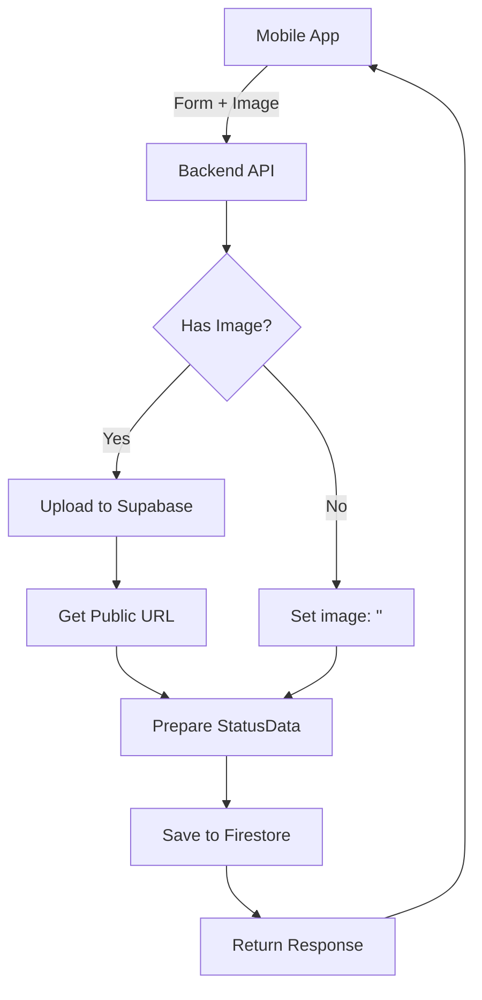

# Image Upload Architecture: Supabase Storage + Firestore Integration

## Overview

This document outlines the architecture for uploading images to **Supabase Storage** and storing their public URLs in **Firestore** as part of the status creation/update system. The implementation supports both scenarios: with image uploads and without images.

## Architecture Components

### 1. Technology Stack

- **Supabase Storage**: Primary image file storage
- **Firestore**: Metadata and URL storage (following `StatusData` schema)
- **Multer**: File upload middleware (`import multer from 'multer'`)
- **Express.js**: Backend API endpoints
- **React Native**: Mobile client with image picker

### 2. Data Flow Architecture



## File Structure and Naming

### Supabase Storage Structure

```
status-images/
├── {userId}/
│   ├── status-{timestamp}-v1.jpg
│   ├── status-{timestamp}-v2.png
│   └── status-{timestamp}-deleted.webp
└── {userId2}/
    └── status-{timestamp}-v1.jpg
```

### Naming Convention

```typescript
const generateImagePath = (userId: string, parentId: string, versionId: string, extension: string) => {
  return `status-images/${userId}/${parentId}-${versionId}.${extension}`;
};

// Examples:
// status-images/user123/status-1697123456789-v1.jpg
// status-images/user123/status-1697123456789-v2.png
// status-images/user123/status-1697123456789-deleted.webp
```

## Implementation Details

### 1. Backend Setup

#### Multer Configuration

```typescript
// config/multerConfig.ts
import multer from 'multer';

const storage = multer.memoryStorage();

const fileFilter = (req: any, file: any, cb: any) => {
  // Accept images only
  if (file.mimetype.startsWith('image/')) {
    cb(null, true);
  } else {
    cb(new Error('Only image files are allowed!'), false);
  }
};

export const upload = multer({
  storage,
  fileFilter,
  limits: {
    fileSize: 5 * 1024 * 1024, // 5MB limit
  },
});
```

#### Supabase Storage Service

```typescript
// services/ImageUploadService.ts
import { supabase } from '@/lib/supabaseConfig';
import { StatusData } from '@/types/types';

export class ImageUploadService {
  private static readonly BUCKET_NAME = 'status-images';

  static async uploadStatusImage(
    file: Express.Multer.File,
    userId: string,
    parentId: string,
    versionId: string
  ): Promise<string> {
    try {
      // Generate unique file path
      const fileExtension = file.originalname.split('.').pop() || 'jpg';
      const filePath = `status-images/${userId}/${parentId}-${versionId}.${fileExtension}`;

      console.log('📤 Uploading image to Supabase:', {
        filePath,
        size: file.size,
        mimetype: file.mimetype,
      });

      // Upload file to Supabase Storage
      const { data: uploadData, error: uploadError } = await supabase.storage
        .from(this.BUCKET_NAME)
        .upload(filePath, file.buffer, {
          contentType: file.mimetype,
          upsert: true, // Replace if exists (for status updates)
        });

      if (uploadError) {
        console.error('❌ Supabase upload error:', uploadError);
        throw new Error(`Failed to upload image: ${uploadError.message}`);
      }

      console.log('✅ Image uploaded successfully:', uploadData.path);

      // Get public URL
      const { data: urlData } = supabase.storage.from(this.BUCKET_NAME).getPublicUrl(filePath);

      if (!urlData?.publicUrl) {
        throw new Error('Failed to get public URL from Supabase');
      }

      console.log('✅ Public URL generated:', urlData.publicUrl);
      return urlData.publicUrl;
    } catch (error) {
      console.error('❌ Error in uploadStatusImage:', error);
      throw error;
    }
  }

  static async deleteStatusImage(imageUrl: string): Promise<void> {
    try {
      if (!imageUrl || imageUrl === '') {
        return; // Nothing to delete
      }

      // Extract file path from public URL
      const url = new URL(imageUrl);
      const pathSegments = url.pathname.split('/');
      const filePath = pathSegments.slice(-3).join('/'); // userId/filename

      console.log('🗑️ Deleting image from Supabase:', filePath);

      const { error } = await supabase.storage.from(this.BUCKET_NAME).remove([`status-images/${filePath}`]);

      if (error) {
        console.error('❌ Error deleting image:', error);
        // Don't throw - deletion failure shouldn't break status operations
      } else {
        console.log('✅ Image deleted successfully');
      }
    } catch (error) {
      console.error('❌ Error in deleteStatusImage:', error);
      // Don't throw - deletion failure shouldn't break status operations
    }
  }

  static async replaceStatusImage(
    oldImageUrl: string,
    newFile: Express.Multer.File,
    userId: string,
    parentId: string,
    versionId: string
  ): Promise<string> {
    try {
      // Delete old image first (optional - upsert handles replacement)
      if (oldImageUrl && oldImageUrl !== '') {
        await this.deleteStatusImage(oldImageUrl);
      }

      // Upload new image
      return await this.uploadStatusImage(newFile, userId, parentId, versionId);
    } catch (error) {
      console.error('❌ Error in replaceStatusImage:', error);
      throw error;
    }
  }
}
```

### 2. API Controller Implementation

#### Status Controller with Image Support

```typescript
// controllers/StatusController.ts
import { Request, Response } from 'express';
import { StatusModel } from '@/models/StatusModel';
import { ImageUploadService } from '@/services/ImageUploadService';
import { upload } from '@/config/multerConfig';

export class StatusController {
  // Multer middleware for handling file uploads
  static uploadMiddleware = upload.single('image');

  static async createOrUpdateStatus(req: Request, res: Response) {
    try {
      const { uid } = req.body;
      const imageFile = req.file; // Multer file object

      console.log('📝 Creating/updating status:', {
        uid,
        hasImage: !!imageFile,
        imageSize: imageFile?.size,
        body: { ...req.body, image: imageFile ? '[FILE_OBJECT]' : undefined },
      });

      // Validate required fields
      if (!uid) {
        return res.status(400).json({
          success: false,
          message: 'User ID is required',
        });
      }

      // Prepare status data (excluding image for now)
      const statusData = {
        uid,
        firstName: req.body.firstName,
        lastName: req.body.lastName,
        condition: req.body.condition,
        phoneNumber: req.body.phoneNumber,
        lat: req.body.lat ? parseFloat(req.body.lat) : null,
        lng: req.body.lng ? parseFloat(req.body.lng) : null,
        location: req.body.location || null,
        note: req.body.note || '',
        shareLocation: req.body.shareLocation === 'true',
        shareContact: req.body.shareContact === 'true',
        expirationDuration: parseInt(req.body.expirationDuration) || 24,
        image: '', // Default empty string
      };

      // Create or update status first (to get parentId and versionId)
      const result = await StatusModel.createOrUpdateStatus(uid, statusData);

      let imageUrl = '';
      let parentId = '';
      let versionId = '';

      // Handle different return types from createOrUpdateStatus
      if ('parentId' in result && 'versionId' in result) {
        // New status created
        parentId = result.parentId;
        versionId = result.versionId;
      } else if ('updated' in result && result.updated) {
        // Status updated - need to get the latest version info
        const currentStatus = await StatusModel.getActiveStatus(uid);
        if (currentStatus) {
          parentId = currentStatus.parentId;
          versionId = currentStatus.versionId;
        }
      } else {
        // No changes made or other result
        return res.status(200).json({
          success: true,
          message: result.reason || 'Status processed',
          data: result,
        });
      }

      // Handle image upload if file exists
      if (imageFile && parentId && versionId) {
        try {
          console.log('📤 Processing image upload...');
          imageUrl = await ImageUploadService.uploadStatusImage(imageFile, uid, parentId, versionId);

          // Update the status with the image URL
          await StatusModel.conditionalUpdateStatus(uid, parentId, {
            image: imageUrl,
          });

          console.log('✅ Image uploaded and status updated with URL');
        } catch (imageError) {
          console.error('❌ Image upload failed:', imageError);
          // Continue without image - don't fail the entire operation
          console.log('⚠️ Continuing with status creation without image');
        }
      }

      // Get final status data
      const finalStatus = await StatusModel.getActiveStatus(uid);

      return res.status(200).json({
        success: true,
        message: 'Status processed successfully',
        data: {
          status: finalStatus,
          imageUploaded: !!imageUrl,
          imageUrl: imageUrl || null,
        },
      });
    } catch (error) {
      console.error('❌ Error in createOrUpdateStatus:', error);
      return res.status(500).json({
        success: false,
        message: 'Internal server error',
        error: error instanceof Error ? error.message : 'Unknown error',
      });
    }
  }

  static async updateStatusImage(req: Request, res: Response) {
    try {
      const { uid, parentId } = req.body;
      const imageFile = req.file;

      if (!uid || !parentId) {
        return res.status(400).json({
          success: false,
          message: 'User ID and Parent ID are required',
        });
      }

      if (!imageFile) {
        return res.status(400).json({
          success: false,
          message: 'Image file is required',
        });
      }

      // Get current status
      const currentStatus = await StatusModel.getActiveStatus(uid);
      if (!currentStatus) {
        return res.status(404).json({
          success: false,
          message: 'Active status not found',
        });
      }

      // Upload new image (this will replace existing one due to same path)
      const imageUrl = await ImageUploadService.replaceStatusImage(
        currentStatus.image,
        imageFile,
        uid,
        parentId,
        currentStatus.versionId
      );

      // Update status with new image URL
      const result = await StatusModel.conditionalUpdateStatus(uid, parentId, {
        image: imageUrl,
      });

      return res.status(200).json({
        success: true,
        message: 'Image updated successfully',
        data: {
          imageUrl,
          result,
        },
      });
    } catch (error) {
      console.error('❌ Error in updateStatusImage:', error);
      return res.status(500).json({
        success: false,
        message: 'Failed to update image',
        error: error instanceof Error ? error.message : 'Unknown error',
      });
    }
  }

  static async deleteStatusImage(req: Request, res: Response) {
    try {
      const { uid, parentId } = req.params;

      // Get current status
      const currentStatus = await StatusModel.getActiveStatus(uid);
      if (!currentStatus) {
        return res.status(404).json({
          success: false,
          message: 'Active status not found',
        });
      }

      // Delete image from Supabase
      await ImageUploadService.deleteStatusImage(currentStatus.image);

      // Update status to remove image URL
      const result = await StatusModel.conditionalUpdateStatus(uid, parentId, {
        image: '',
      });

      return res.status(200).json({
        success: true,
        message: 'Image deleted successfully',
        data: result,
      });
    } catch (error) {
      console.error('❌ Error in deleteStatusImage:', error);
      return res.status(500).json({
        success: false,
        message: 'Failed to delete image',
        error: error instanceof Error ? error.message : 'Unknown error',
      });
    }
  }
}
```

### 3. API Routes Setup

```typescript
// routes/statusRoutes.ts
import express from 'express';
import { StatusController } from '@/controllers/StatusController';

const router = express.Router();

// Create or update status with optional image
router.post(
  '/status',
  StatusController.uploadMiddleware, // Multer middleware
  StatusController.createOrUpdateStatus
);

// Update only the image of existing status
router.put('/status/image', StatusController.uploadMiddleware, StatusController.updateStatusImage);

// Delete image from existing status
router.delete('/status/:uid/:parentId/image', StatusController.deleteStatusImage);

export default router;
```

### 4. Frontend Implementation

#### React Native Image Upload

```typescript
// hooks/useImageUpload.ts
import { useState } from 'react';
import * as ImagePicker from 'expo-image-picker';
import { Alert } from 'react-native';

export const useImageUpload = () => {
  const [image, setImage] = useState<string | null>(null);
  const [uploading, setUploading] = useState(false);

  const pickImage = async () => {
    try {
      const { status } = await ImagePicker.requestMediaLibraryPermissionsAsync();

      if (status !== 'granted') {
        Alert.alert('Permission needed', 'Please grant camera roll permissions');
        return;
      }

      const result = await ImagePicker.launchImageLibraryAsync({
        mediaTypes: ImagePicker.MediaTypeOptions.Images,
        allowsEditing: true,
        aspect: [4, 3],
        quality: 0.8,
        base64: false,
      });

      if (!result.canceled && result.assets[0]) {
        setImage(result.assets[0].uri);
        return result.assets[0];
      }
    } catch (error) {
      console.error('Error picking image:', error);
      Alert.alert('Error', 'Failed to pick image');
    }
    return null;
  };

  const takePhoto = async () => {
    try {
      const { status } = await ImagePicker.requestCameraPermissionsAsync();

      if (status !== 'granted') {
        Alert.alert('Permission needed', 'Please grant camera permissions');
        return;
      }

      const result = await ImagePicker.launchCameraAsync({
        allowsEditing: true,
        aspect: [4, 3],
        quality: 0.8,
        base64: false,
      });

      if (!result.canceled && result.assets[0]) {
        setImage(result.assets[0].uri);
        return result.assets[0];
      }
    } catch (error) {
      console.error('Error taking photo:', error);
      Alert.alert('Error', 'Failed to take photo');
    }
    return null;
  };

  const clearImage = () => {
    setImage(null);
  };

  return {
    image,
    setImage,
    uploading,
    setUploading,
    pickImage,
    takePhoto,
    clearImage,
  };
};
```

#### Status Form with Image Upload

```typescript
// services/statusService.ts
import { API_ROUTES } from '@/config/endpoints';

export const createStatusWithImage = async (statusData: any, imageAsset?: ImagePicker.ImagePickerAsset) => {
  try {
    const formData = new FormData();

    // Add all status fields to FormData
    Object.keys(statusData).forEach(key => {
      if (statusData[key] !== null && statusData[key] !== undefined) {
        formData.append(key, statusData[key].toString());
      }
    });

    // Add image if exists
    if (imageAsset) {
      const imageUri = imageAsset.uri;
      const filename = imageUri.split('/').pop() || 'image.jpg';
      const match = /\.(\w+)$/.exec(filename);
      const type = match ? `image/${match[1]}` : 'image/jpeg';

      formData.append('image', {
        uri: imageUri,
        name: filename,
        type,
      } as any);

      console.log('📤 Uploading status with image:', {
        filename,
        type,
        size: imageAsset.fileSize,
      });
    } else {
      console.log('📝 Creating status without image');
    }

    const response = await fetch(API_ROUTES.STATUS.CREATE, {
      method: 'POST',
      headers: {
        'Content-Type': 'multipart/form-data',
        Authorization: `Bearer ${token}`,
      },
      body: formData,
    });

    const result = await response.json();

    if (!response.ok) {
      throw new Error(result.message || 'Failed to create status');
    }

    console.log('✅ Status created successfully:', result);
    return result;
  } catch (error) {
    console.error('❌ Error creating status:', error);
    throw error;
  }
};
```

## Error Handling Strategy

### 1. Image Upload Errors

```typescript
const handleImageUploadError = (error: any): string => {
  console.error('Image upload error:', error);

  if (error.message?.includes('File too large')) {
    return 'Image file is too large. Please choose a smaller image (max 5MB).';
  }

  if (error.message?.includes('Invalid file type')) {
    return 'Please select a valid image file (JPG, PNG, WebP).';
  }

  if (error.message?.includes('Storage quota')) {
    return 'Storage limit reached. Please contact support.';
  }

  return 'Failed to upload image. Please try again.';
};
```

### 2. Graceful Degradation

```typescript
// Always prioritize status creation over image upload
try {
  // Create status first
  const statusResult = await StatusModel.createOrUpdateStatus(uid, statusData);

  // Then try image upload
  if (imageFile && statusResult) {
    try {
      const imageUrl = await ImageUploadService.uploadStatusImage(/*...*/);
      await StatusModel.conditionalUpdateStatus(uid, parentId, { image: imageUrl });
    } catch (imageError) {
      console.warn('⚠️ Image upload failed, continuing without image:', imageError);
      // Status is still created successfully
    }
  }

  return { success: true, statusResult };
} catch (statusError) {
  // Only fail if status creation fails
  throw statusError;
}
```

## Security Considerations

### 1. File Validation

```typescript
const validateImageFile = (file: Express.Multer.File): boolean => {
  // Check file type
  const allowedTypes = ['image/jpeg', 'image/jpg', 'image/png', 'image/webp'];
  if (!allowedTypes.includes(file.mimetype)) {
    throw new Error('Invalid file type. Only JPG, PNG, and WebP are allowed.');
  }

  // Check file size (5MB limit)
  const maxSize = 5 * 1024 * 1024;
  if (file.size > maxSize) {
    throw new Error('File too large. Maximum size is 5MB.');
  }

  return true;
};
```

### 2. Access Control

```typescript
// Supabase Storage RLS Policy
/*
-- Enable RLS on storage.objects
ALTER TABLE storage.objects ENABLE ROW LEVEL SECURITY;

-- Policy: Users can only access their own status images
CREATE POLICY "Users can view own status images" ON storage.objects
  FOR SELECT USING (bucket_id = 'status-images' AND 
    auth.uid()::text = (storage.foldername(name))[1]);

CREATE POLICY "Users can upload own status images" ON storage.objects
  FOR INSERT WITH CHECK (bucket_id = 'status-images' AND 
    auth.uid()::text = (storage.foldername(name))[1]);

CREATE POLICY "Users can update own status images" ON storage.objects
  FOR UPDATE USING (bucket_id = 'status-images' AND 
    auth.uid()::text = (storage.foldername(name))[1]);

CREATE POLICY "Users can delete own status images" ON storage.objects
  FOR DELETE USING (bucket_id = 'status-images' AND 
    auth.uid()::text = (storage.foldername(name))[1]);
*/
```

## Performance Optimization

### 1. Image Compression

```typescript
// Before upload - compress images on mobile
import { manipulateAsync, SaveFormat } from 'expo-image-manipulator';

const compressImage = async (uri: string): Promise<string> => {
  const result = await manipulateAsync(
    uri,
    [{ resize: { width: 1024 } }], // Resize to max 1024px width
    { compress: 0.8, format: SaveFormat.JPEG }
  );

  return result.uri;
};
```

### 2. Lazy Loading

```typescript
// On mobile - lazy load images
import FastImage from 'react-native-fast-image';

const StatusImage = ({ imageUrl }: { imageUrl: string }) => {
  if (!imageUrl) return null;

  return (
    <FastImage
      style={{ width: 200, height: 150 }}
      source={{
        uri: imageUrl,
        priority: FastImage.priority.normal,
        cache: FastImage.cacheControl.immutable,
      }}
      resizeMode={FastImage.resizeMode.cover}
    />
  );
};
```

### 3. CDN and Caching

```typescript
// Supabase automatically provides CDN
const getOptimizedImageUrl = (originalUrl: string, width?: number): string => {
  if (!originalUrl) return '';

  // Supabase supports image transformations
  const url = new URL(originalUrl);
  if (width) {
    url.searchParams.set('width', width.toString());
    url.searchParams.set('quality', '80');
  }

  return url.toString();
};
```

## Monitoring and Analytics

### 1. Upload Metrics

```typescript
const trackImageUpload = (success: boolean, fileSize?: number, duration?: number) => {
  console.log('📊 Image Upload Metrics:', {
    success,
    fileSize,
    duration,
    timestamp: new Date().toISOString(),
  });

  // Send to analytics service
  // analytics.track('image_upload', { success, fileSize, duration });
};
```

### 2. Error Tracking

```typescript
const trackImageError = (error: any, context: string) => {
  console.error('📊 Image Error:', {
    error: error.message,
    context,
    timestamp: new Date().toISOString(),
  });

  // Send to error tracking service
  // errorTracking.captureException(error, { context });
};
```

## Testing Strategy

### 1. Unit Tests

```typescript
// tests/ImageUploadService.test.ts
describe('ImageUploadService', () => {
  test('should upload image successfully', async () => {
    const mockFile = {
      buffer: Buffer.from('test'),
      mimetype: 'image/jpeg',
      originalname: 'test.jpg',
    };

    const result = await ImageUploadService.uploadStatusImage(
      mockFile as Express.Multer.File,
      'user123',
      'status-123',
      'status-123-v1'
    );

    expect(result).toMatch(/^https:\/\//);
  });

  test('should handle upload errors gracefully', async () => {
    // Mock Supabase error
    const mockFile = null;

    await expect(ImageUploadService.uploadStatusImage(mockFile, 'user123', 'status-123', 'v1')).rejects.toThrow();
  });
});
```

### 2. Integration Tests

```typescript
// tests/status-image-flow.test.ts
describe('Status with Image Flow', () => {
  test('should create status with image', async () => {
    const response = await request(app)
      .post('/api/status')
      .field('uid', 'test-user')
      .field('firstName', 'John')
      .field('lastName', 'Doe')
      .field('condition', 'safe')
      .attach('image', 'tests/fixtures/test-image.jpg')
      .expect(200);

    expect(response.body.data.imageUploaded).toBe(true);
    expect(response.body.data.imageUrl).toMatch(/supabase/);
  });

  test('should create status without image', async () => {
    const response = await request(app)
      .post('/api/status')
      .field('uid', 'test-user')
      .field('firstName', 'John')
      .field('lastName', 'Doe')
      .field('condition', 'safe')
      .expect(200);

    expect(response.body.data.imageUploaded).toBe(false);
    expect(response.body.data.status.image).toBe('');
  });
});
```

## Deployment Checklist

### 1. Supabase Setup

- [ ] Create `status-images` bucket in Supabase Storage
- [ ] Configure bucket as public or set appropriate RLS policies
- [ ] Set up CORS if needed for web uploads
- [ ] Configure file size limits in Supabase dashboard

### 2. Environment Variables

```env
# Backend .env
SUPABASE_URL=your-project-url
SUPABASE_SERVICE_KEY=your-service-role-key
```

### 3. Firestore Security Rules

```javascript
// Ensure Firestore rules allow image URL storage
rules_version = '2';
service cloud.firestore {
  match /databases/{database}/documents {
    match /status/{userId}/statuses/{statusId} {
      allow read, write: if request.auth != null &&
        request.auth.uid == userId &&
        // Validate image field
        (!('image' in resource.data) ||
         resource.data.image is string);
    }
  }
}
```

## Conclusion

This architecture provides a robust, scalable solution for handling image uploads in the status system:

### ✅ **Benefits**

- **Clean Separation**: Files in Supabase, metadata in Firestore
- **Fallback Handling**: Works with or without images
- **Version Support**: Each status version can have its own image
- **Performance**: CDN delivery, optimized storage
- **Security**: Proper access controls and validation
- **Scalability**: Handles large files and user bases

### 🔧 **Key Features**

- Multer-based file handling with proper validation
- Supabase Storage integration with public URLs
- Seamless Firestore integration following StatusData schema
- Comprehensive error handling and graceful degradation
- Mobile-optimized image handling with compression
- Complete test coverage and monitoring

This implementation ensures that image handling enhances the status system without compromising reliability or performance.
