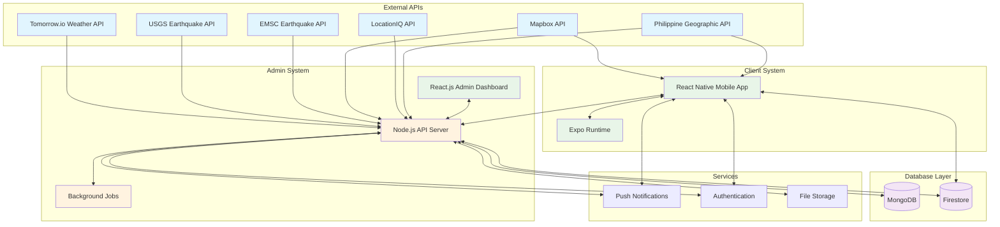
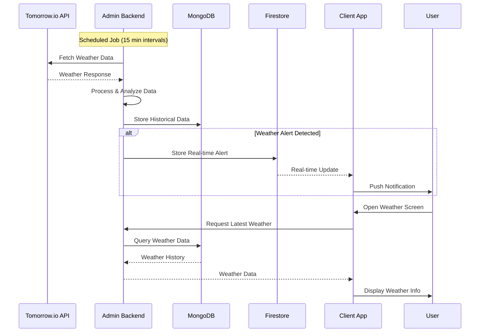
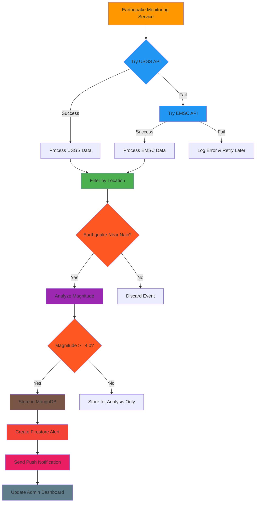
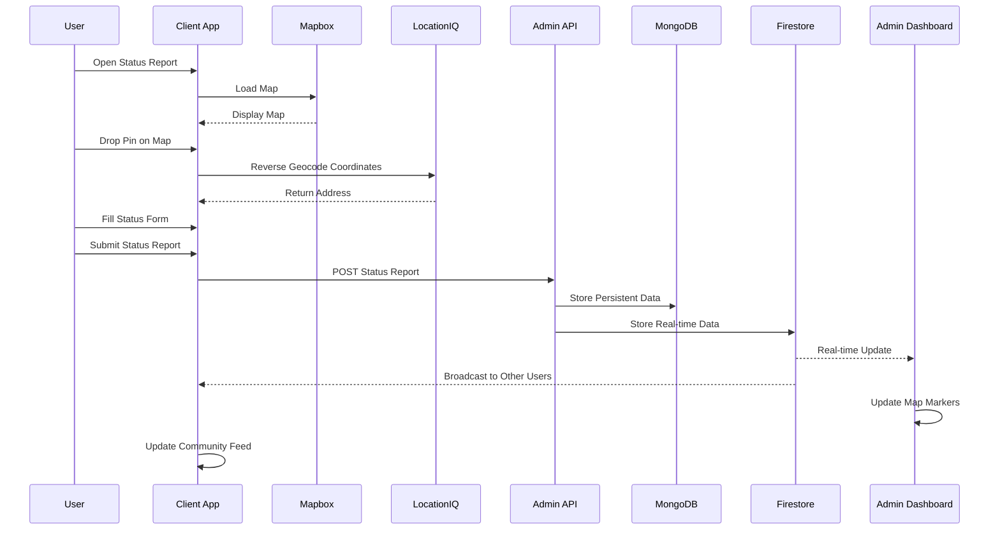
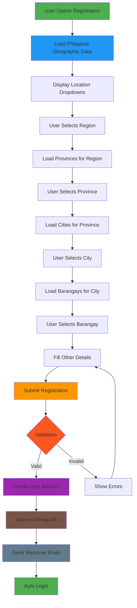
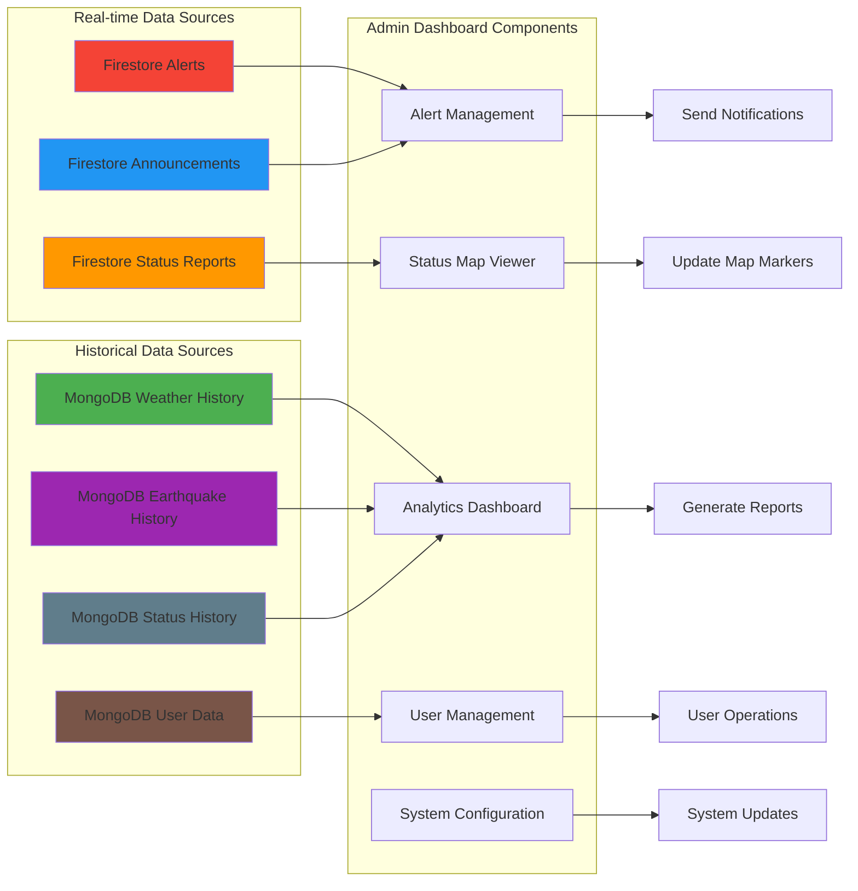
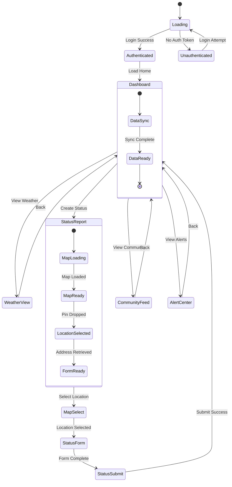
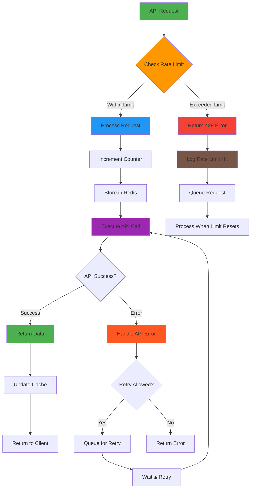
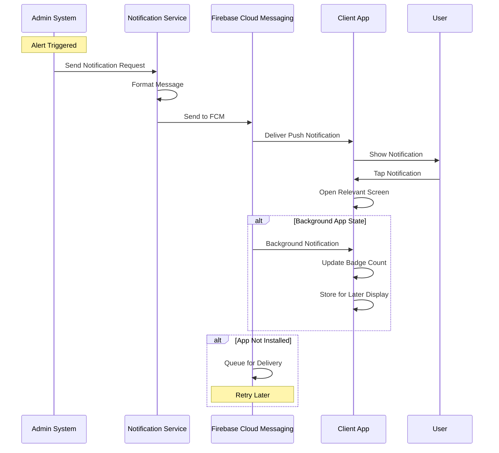
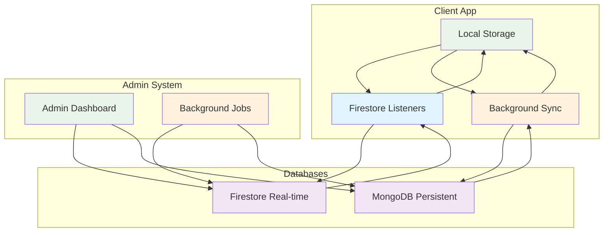

# RescueNect System Flow Diagrams

## Overview
This document contains visual representations of the RescueNect system flows, including data movement, user interactions, and system processes.

## 1. Overall System Architecture Flow

## 2. Weather Data Flow

## 3. Earthquake Monitoring Flow

## 4. Status Reporting Flow

## 5. User Registration Flow

## 6. Admin Dashboard Data Flow

## 7. Mobile App State Management Flow

## 8. API Rate Limiting Flow

## 9. Push Notification Flow

## 10. Data Synchronization Flow

## Color Legend

- 🔵 **Blue**: External APIs and Services
- 🟢 **Green**: Client-side Components  
- 🟠 **Orange**: Admin/Backend Components
- 🟣 **Purple**: Database Systems
- 🔴 **Red**: Alerts and Critical Processes
- 🟤 **Brown**: Data Storage and Persistence
- 🔘 **Gray**: System Operations and Background Jobs

## System Performance Metrics

### Expected Response Times
- **Weather Data Fetch**: < 2 seconds
- **Earthquake Alert**: < 5 seconds
- **Status Report Submission**: < 3 seconds
- **Map Loading**: < 4 seconds
- **Push Notification Delivery**: < 10 seconds

### Database Performance
- **Firestore Read/Write**: < 100ms
- **MongoDB Query**: < 200ms
- **Cache Hit Rate**: > 90%
- **API Rate Limit Usage**: < 80%

### Scalability Targets
- **Concurrent Users**: 1,000+
- **Status Reports/Day**: 10,000+
- **Push Notifications/Day**: 50,000+
- **Map Interactions/Day**: 25,000+

This visual documentation provides a comprehensive understanding of how data flows through the RescueNect system, helping developers and stakeholders understand the system architecture and implementation details.
